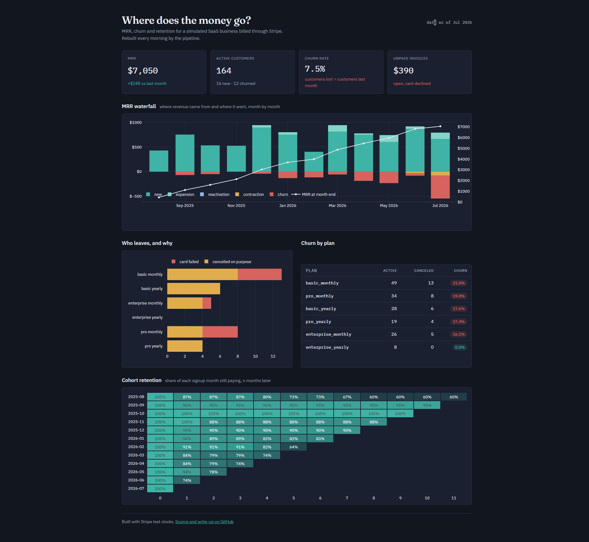
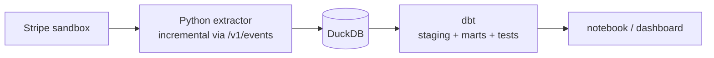

# saas-billing-pipeline


*A tiny SaaS company, a real Stripe API, and the question every founder asks at 2 a.m.: where does the money go?*

I built a fake SaaS business in a Stripe sandbox (three plans, 200 customers, twelve simulated months of signups,
upgrades, cancellations and bouncing credit cards) and the pipeline that turns its billing data into MRR, churn,
cohort retention and lifetime value. It runs itself: GitHub Actions advances the business one day every morning and
republishes the numbers.

**→ [Live dashboard](https://mcvelferdomadenik-cloud.github.io/saas-billing-pipeline/)**

[](https://mcvelferdomadenik-cloud.github.io/saas-billing-pipeline/)

## What the data says

- MRR grew from **$429 to $7,050** in a year, almost all of it from new signups, nobody upgrades on their own.
- Churn sits at **2–4% a month**, except one 7.5% spike when Stripe gave up on a batch of failing cards.
- **A quarter of all churn is accidental**: 10 customers didn't leave, their card did. ~$4,700 a year recoverable with
  one "please update your card" email.
- Enterprise customers are worth ~$3,600 over their lifetime; Basic monthly is the cheapest *and* the leakiest plan.

The full analysis (charts, cohort tables, LTV by plan and a summary) is in
**[`notebooks/analysis.ipynb`](notebooks/analysis.ipynb)**.

## How it works



`seed` builds the business on Stripe test clocks · `sync` pulls what changed since the last run · `load` upserts it
into DuckDB · `dbt build` models it and runs 28 data tests · `export` feeds the dashboard. Every step is idempotent —
if it crashes, run it again.

## Run it yourself

You need a [Stripe sandbox](https://docs.stripe.com/sandboxes) key and Docker.

```
echo STRIPE_API_KEY=sk_test_... > .env
docker compose build
docker compose run --rm pipeline seed --customers 200   # once, ~30 min: Stripe does the billing
docker compose run --rm pipeline                        # sync → load → dbt build → export
```

Results land in `data/` (DuckDB warehouse) and `docs/data.json` (dashboard). Open the dashboard with
`python -m http.server --directory docs`, or the notebook with `uv sync` + `notebooks/analysis.ipynb`.

Without Docker: `uv sync`, then the same commands as `uv run python -m pipeline.run <command>` and `cd dbt && uv run dbt build`.

## Stack

Python 3.14 · uv · requests · DuckDB · dbt · pandas · plotly · pytest · ruff · Docker · GitHub Actions · Plotly.js on GitHub Pages
