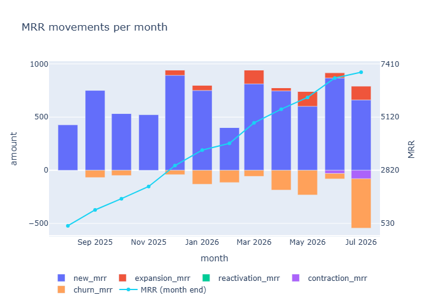
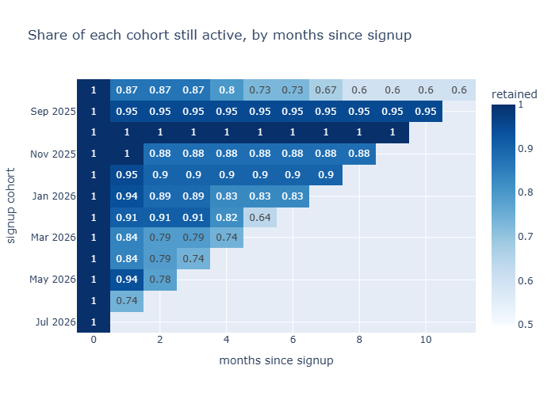
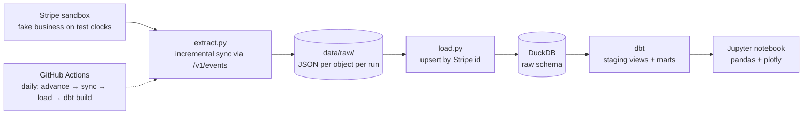

# saas-billing-pipeline


*A tiny SaaS company, a real Stripe API, and the question every founder asks at 2 a.m.: where does the money go?*

I built a fake SaaS business inside a Stripe sandbox — three plans, 200 customers, twelve simulated months of signups,
upgrades, cancellations and bouncing credit cards — and then the data pipeline that turns Stripe's billing data into the
numbers leadership actually wants: MRR and its movements, churn and why it happens, cohort retention, lifetime value,
and how much revenue quietly leaks through failed payments.

The pipeline runs itself: every push is linted and tested, and every morning GitHub Actions advances the simulated
business by one day and refreshes the warehouse.

## What the data says



- MRR grew from **$429 to $7,050** in a year, almost entirely from new signups — upgrades barely register.
- Monthly churn sits at **2–4%**, except one month at 7.5% when Stripe gave up on a batch of failing cards.
- **A quarter of all churn is accidental**: 10 customers didn't leave, their credit card did. That's ~$4,700 a year
  recoverable with a "please update your card" email — the cheapest win on the list.
- Enterprise customers are worth ~$3,600 over their lifetime; Basic monthly is the cheapest *and* the leakiest plan.



The full walk-through — with the churn-by-plan and LTV tables and a summary for leadership — is in
[`notebooks/analysis.ipynb`](notebooks/analysis.ipynb).

## How it works



1. **`seed`** creates the business. Stripe *test clocks* let you fast-forward time, so subscriptions really bill,
   renew, upgrade and get cancelled — some customers even get a card that always declines.
2. **`sync`** copies everything out of Stripe, raw. First run is a full backfill; every later run asks
   `/v1/events` "what changed since my cursor?" and fetches only that.
3. **`load`** upserts the raw JSON into DuckDB. Run it a hundred times, get the same tables.
4. **`dbt build`** turns JSON blobs into a dimensional model and computes the MRR waterfall — with 28 data tests.
5. **`analysis.ipynb`** asks the tables the leadership questions and writes down what it found.
6. **`advance`** moves every test clock one day forward, so tomorrow there is something new to sync.

Everything is idempotent: seeding skips finished cohorts, sync resumes from its cursor, load upserts, dbt rebuilds.
If a step crashes halfway, run it again.

## Quick start

1. Create a [Stripe sandbox](https://docs.stripe.com/sandboxes) and put its secret test key in a `.env` file
   in the project root:

   ```
   STRIPE_API_KEY=sk_test_...
   ```

2. Install everything (Python 3.14, managed with [uv](https://docs.astral.sh/uv/)):

   ```
   uv sync
   ```

3. Build the business and the warehouse:

   ```
   uv run python -m pipeline.run seed --customers 200   # ~30 min, Stripe does the billing
   uv run python -m pipeline.run sync
   uv run python -m pipeline.run load
   cd dbt && uv run dbt build && cd ..
   ```

4. Open `notebooks/analysis.ipynb` and run all cells.

## Commands

| Command | What it does |
| --- | --- |
| `uv run python -m pipeline.run seed --customers 200` | Seed the sandbox: 3 plans, ~200 customers, 12 months of simulated billing via test clocks |
| `uv run python -m pipeline.run sync` | Extract customers, subscriptions, invoices, charges and events into `data/raw/`. First run is a full backfill; later runs are incremental via `/v1/events` and the cursor in `data/state.json`. Add `--full` to force a backfill. |
| `uv run python -m pipeline.run load` | Load `data/raw/` into DuckDB (`data/warehouse.duckdb`, schema `raw`), upserting by Stripe id so re-runs never duplicate rows |
| `uv run python -m pipeline.run advance` | Move every test clock forward one day (`--days N` for more), so the simulated business keeps billing |
| `cd dbt && uv run dbt build` | Build staging views and marts tables in DuckDB and run all 28 data tests |
| `uv run python -m pytest` | Run the Python tests (fake Stripe API, in-memory DuckDB — no network needed) |
| `uv run python -m ruff check .` | Lint the code |

## Data model

`dbt/models/staging/` unpacks the raw Stripe JSON into typed views — one per raw table
(`stg_customers`, `stg_subscriptions`, `stg_invoices`, `stg_charges`, `stg_subscription_events`).

`dbt/models/marts/` is where the business logic lives:

| Model | Grain | What it answers |
| --- | --- | --- |
| `dim_plan` | one row per price | plan catalog, with yearly prices normalised to monthly MRR |
| `dim_customer` | one row per customer | cohort month, current plan, lifetime revenue |
| `fct_invoices` | one row per invoice | revenue, unpaid amounts, payment attempts |
| `fct_subscription_events` | one row per start / upgrade / downgrade / cancellation | MRR before and after each change |
| `mrr_customer_monthly` | customer × month | month-end MRR and its movement: new, expansion, contraction, churn, reactivation |
| `mrr_monthly` | one row per month | the MRR waterfall — reconciles to the cent |

## Automation

Two GitHub Actions workflows in `.github/workflows/`:

- **`ci.yml`** runs on every push: ruff, pytest, then `dbt build` against a small committed fixture
  (`tests/fixtures/raw/`, two test clocks' worth of sandbox data) so all 28 data tests run without touching Stripe.
- **`pipeline.yml`** runs every day at 06:00 UTC: `advance` → `sync` → `load` → `dbt build`. The Stripe key lives in a
  repository secret, and `data/` is carried between runs with `actions/cache`, so each day's sync is incremental
  rather than a full backfill.

Stripe deletes sandbox test clocks after ~30 days. When that happens, `seed` and `sync --full` rebuild the business
from scratch — everything downstream is idempotent, so nothing else changes.

## Stack

| Tool | Where it's used | Why |
| --- | --- | --- |
| **Python 3.14** + [uv](https://docs.astral.sh/uv/) | everything | uv handles the venv, the lockfile and `uv run` — one tool instead of pip + venv + pip-tools |
| [requests](https://requests.readthedocs.io/) | `extract.py` | plain HTTP against the Stripe REST API, so auth, pagination and retries are explicit |
| [stripe](https://github.com/stripe/stripe-python) SDK | `seed.py`, `clocks.py` | writing to Stripe (creating customers, advancing test clocks) is nicer through the SDK |
| [DuckDB](https://duckdb.org/) | `load.py`, warehouse | an analytical database in a single file — reads JSON natively, fast `GROUP BY`, zero setup |
| [dbt-duckdb](https://github.com/duckdb/dbt-duckdb) | `dbt/` | SQL transformations with dependencies, tests and docs; the industry-standard "T" in ELT |
| [pandas](https://pandas.pydata.org/) + [plotly](https://plotly.com/python/) | notebook | reshaping mart tables for charts; interactive charts that also render as PNG on GitHub |
| [pytest](https://docs.pytest.org/) | `tests/` | 16 tests with a fake Stripe session and an in-memory DuckDB |
| [ruff](https://docs.astral.sh/ruff/) | CI | linting + formatting, one tool |
| [GitHub Actions](https://docs.github.com/actions) | `.github/workflows/` | CI on push, daily scheduled pipeline, secrets, cache |

## Project layout

```
.
├── src/pipeline/
│   ├── config.py        # reads STRIPE_API_KEY from .env / the environment
│   ├── customers.py     # reproducible fake customer profiles (pure logic)
│   ├── seed.py          # builds the business in the Stripe sandbox
│   ├── extract.py       # StripeClient + backfill / incremental sync
│   ├── load.py          # raw JSON → DuckDB upserts
│   ├── clocks.py        # advance test clocks
│   └── run.py           # CLI: seed | sync | load | advance
├── dbt/                 # staging + marts models, tests, profiles
├── notebooks/           # analysis.ipynb
├── tests/               # pytest + the CI fixture
├── scripts/             # make_ci_fixture.py
├── docs/img/            # charts used in this README
└── .github/workflows/   # ci.yml, pipeline.yml
```

## Things I ran into

- **Test-clock objects are invisible to plain list endpoints.** `/v1/customers` returns nothing; you have to walk
  the test clocks first. `/v1/events`, luckily, sees everything.
- **Row-by-row inserts into DuckDB are slow** (13k events took minutes). Writing a staging file and doing one
  `INSERT … SELECT … ON CONFLICT DO UPDATE` takes 3 seconds.
- **Event timestamps are real time, not simulated time.** For the MRR timeline I had to take the subscription's own
  `current_period_start` from inside the event payload.
- **Money is `decimal`, not `float`.** Otherwise your waterfall is off by $0.0000000002 and the reconciliation test fails.
- **"Works on my machine" is not a test.** GitHub's runner fired 71 clock advances faster than my laptop and hit
  Stripe's rate limit — hence the backoff in `clocks.py`.
- The Stripe API moved `invoice.subscription` to `invoice.parent.subscription_details.subscription` and dropped
  `charge.invoice` — the docs you read and the JSON you get are not always the same version.
